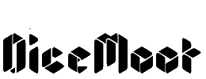

## Welcome to Dicemoot

Dicemoot is a isometric board game simulation environment that aims to make it easier to play boardgames online.

The core feature of DiceMoot is  allowing players to import 2D images and convert them into 3D tokens, into a scalable gridded map the tokens can be placed upon. Dicemoot allows the creation of objects, environments, and characters that look nice on the board without specilized knowledge of 3D sculpting.

### Proposed Implementation

For ease of access for users of all types a web interface would serve well. Rendering the 3D model of the game board, character tokens and the like could be implemented via [threejs](https://threejs.org/). Examples such as [this one](https://threejs.org/examples/#webgl_geometry_spline_editor) show most of the features necessary to implement the game with this library.

A proof of concept is necessary to show multiplayer access capability on a 3D board with multiple users connecting from different networks.

<iframe width="750" height="455" src="https://xd.adobe.com/embed/03da9373-390e-4709-b9ae-9903479b5f3c-5689/?fullscreen" frameborder="0" allowfullscreen></iframe>
